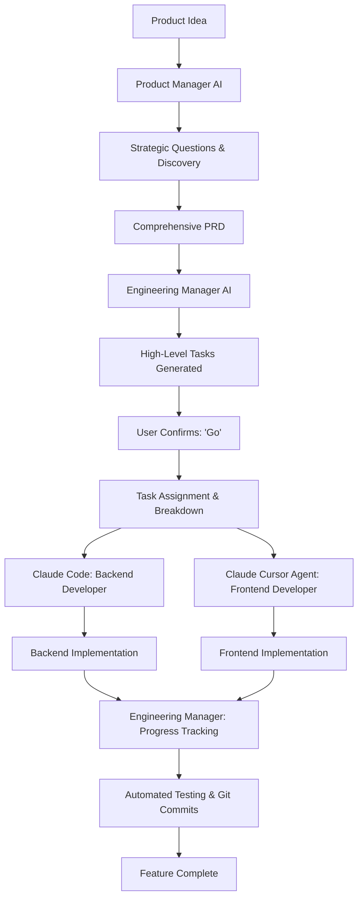

# aidevguide
This is agents of an experienced product manager and a engineering manager who divides the work between front end and back end devs. Front end dev is cursor agent and backend agent is claude code
# AI Product Development Agents

A comprehensive system for AI-driven product development using specialized agents that mirror a real development team: Product Manager, Engineering Manager, Frontend Developer, and Backend Developer.

## 🏗️ Team Structure

| Role | Agent | File | Responsibilities |
|------|-------|------|------------------|
| **Product Manager** | AI Agent | `product-manager-ai.md` | Strategic questions, PRD creation, requirements gathering |
| **Engineering Manager** | AI Agent | `engineering-manager.md` | Task breakdown, work assignment, progress tracking |
| **Frontend Developer** | Claude Cursor Agent | - | UI/UX implementation, client-side logic |
| **Backend Developer** | Claude Code | - | Server-side logic, APIs, database operations |

## 📁 Files Overview

| File | Purpose | Usage |
|------|---------|-------|
| `product-manager-ai.md` | Product Manager AI instructions | Converts product ideas into comprehensive PRDs |
| `engineering-manager.md` | Engineering Manager AI instructions | Breaks down PRDs into assigned tasks for frontend/backend teams |

## 🚀 Quick Start

### Step 1: Product Requirements (PRD Creation)
Reference the Product Manager AI:
```
Please act according to the instructions in this file: 
https://github.com/[your-username]/[repo-name]/blob/main/product-manager-ai.md

I want to build [your product idea here]
```

### Step 2: Engineering Planning & Task Assignment
Reference the Engineering Manager:
```
Please act according to the instructions in this file:
https://github.com/[your-username]/[repo-name]/blob/main/engineering-manager.md

Generate tasks and assign work based on this PRD: [path-to-your-prd-file]
```

## 🔄 Complete Workflow



## 👥 Team Member Responsibilities

### Product Manager AI
- 🎯 **Strategic Discovery:** Asks the right questions to understand user needs
- 📋 **Requirements Gathering:** Ensures complete understanding before writing
- 📄 **PRD Creation:** Comprehensive product requirements documents
- 🎪 **Stakeholder Alignment:** Validates assumptions and clarifies scope
- 📊 **Success Metrics:** Defines measurable outcomes and KPIs

### Engineering Manager AI
- 📋 **Task Breakdown:** Converts PRDs into actionable development tasks
- 👷 **Work Assignment:** Divides tasks between frontend and backend developers
- 📈 **Progress Tracking:** Monitors task completion and maintains task lists
- 🔄 **Process Management:** Enforces one-task-at-a-time implementation
- ✅ **Quality Assurance:** Ensures testing and proper git workflows
- 🗂️ **File Management:** Tracks all created/modified files

### Claude Cursor Agent (Frontend Developer)
- 🎨 **UI/UX Implementation:** Components, layouts, and user interfaces
- ⚛️ **State Management:** Application state and data flow
- 📱 **Responsive Design:** Mobile-first, accessible interfaces
- 🔗 **API Integration:** Frontend data fetching and handling
- 🧪 **Frontend Testing:** Component and end-to-end tests
- ⚡ **Performance Optimization:** Loading, caching, and user experience

### Claude Code (Backend Developer)
- 🛠️ **API Development:** RESTful endpoints and GraphQL APIs
- 🗄️ **Database Operations:** Schema design, migrations, queries
- 🔐 **Security Implementation:** Authentication, authorization, validation
- ⚙️ **Business Logic:** Core application functionality
- 🔄 **Integrations:** External services and third-party APIs
- 🧪 **Backend Testing:** Unit, integration, and performance tests

## 📋 Task Assignment System

Tasks are clearly labeled and assigned:

### `[CLAUDE_CODE]` - Backend Developer Tasks
```markdown
- [ ] [CLAUDE_CODE] Create User authentication API
- [ ] [CLAUDE_CODE] Implement password hashing middleware
- [ ] [CLAUDE_CODE] Write unit tests for auth endpoints
```

### `[CURSOR_AGENT]` - Frontend Developer Tasks
```markdown
- [ ] [CURSOR_AGENT] Build login form component
- [ ] [CURSOR_AGENT] Implement authentication state management
- [ ] [CURSOR_AGENT] Create protected route wrapper
```

## 🔧 Implementation Protocol

### Engineering Manager Enforces:
1. **One Task at a Time:** No parallel task execution
2. **Quality Gates:** All tests must pass before task completion
3. **Proper Git Workflow:** Automated commits with conventional format
4. **Progress Tracking:** Real-time task list updates
5. **File Management:** Comprehensive tracking of all changes

### Example Task Flow:
```
Engineering Manager: "Ready to implement user authentication backend API? (y/n)"
→ User: "y"
→ Claude Code: Implements authentication API + tests
→ Engineering Manager: Marks task complete, runs tests, commits changes
→ Engineering Manager: "Ready for next task: Build login form component? (y/n)"
```

## 📂 Project Structure

```
/your-project
├── docs/
│   ├── prds/
│   │   └── prd-feature-name.md
│   └── tasks/
│       └── tasks-feature-name.md
├── product-manager-ai.md
└── engineering-manager.md
```

## 🎯 Benefits

- **Clear Role Separation:** Each AI agent has specific expertise and responsibilities
- **Systematic Approach:** From idea to implementation with proper planning
- **Quality Assurance:** Built-in testing and review processes
- **Progress Tracking:** Always know what's been done and what's next
- **Scalable Workflow:** Consistent process for any size feature or project
- **Team Coordination:** Prevents conflicts and ensures smooth handoffs

## 📖 Usage Examples

### Starting a New Feature:
```bash
# 1. Product Manager creates PRD
"Act as Product Manager (product-manager-ai.md): I want to add user profiles"

# 2. Engineering Manager breaks down work
"Act as Engineering Manager (engineering-manager.md): Generate tasks from user-profiles-prd.md"

# 3. Development begins with clear assignments
# Backend: Claude Code handles APIs, database, auth
# Frontend: Cursor Agent handles UI, components, state
```

## 🔗 Quick Links

- [Product Manager AI Instructions](./product-manager-ai.md)
- [Engineering Manager AI Instructions](./engineering-manager.md)

---

**Ready to build your next feature with AI-powered team coordination!** 🚀
